# A-simple-messaging-app-in-Python

## Introduction
This project is an assignment for the ELEC-C7420, Principles of Networking course at Aalto University. The main goal is to make a simple messaging app to practice socket programming. The project was implemented using Python and PyQt was used for the GUI.

**The core features of the app:**
- Direct messaging between clients
  - Client can add other users to their conversation list.
  - Client can select what user he/she wants to send the message to.
  - The server delivers messages to the specified user as requested by the client.
- Group messaging
  - Client can create a group.
  - The owner of the group can add/remove members from the group.
  - The owner can rename the group.
  - The server will forward the messages sent to the group to every member of said group.
- Offline messaging
  - Sender is informed if the receiver is offline and when the receiver was online last time.
  - Messages sent to an offline client will be buffered on the server and forwarded to the client once he/she go online again.
- Other features
  - Message display timestamp, sender, and the group (if it is a group message).
  - Check if the receiver has read your message or not.
  - Simutaneous connection of multiple clients.
  - Support both IPv4 and IPv6
- (Bonus feature) File transfer
  - Files of any format can be sent through the app.
  - The receiver is notified whenever someone sent them a file. They can view the information (name and size) of the file.
  - The receiver can decide if he/she wants to receive or discard the file.
- Voluntary extra features 
  - (somewhat) User-friendly and intuitive UI.
  - Server logs that show all messages and tasks carried out.
  - Send message by clicking Enter after the user finished typing.
  - Dedicated message box and conversation view.
  - Selecting active conversation with the mouse.

**Assignment Outcome:** 20/20 points + 2 Bonus points. Overall, I am quite happy with how the project turned out. I was able to learn a lot from this project and build something fun.
  
## Brief Application Walk-through
When you first open the application you will see the following interface. The app has three main elements: a conversation list, a message viewer, and a text box for entering messages. 

The user can select a conversation from the list by clicking on it, which will turn that conversation green and indicate that it is active.

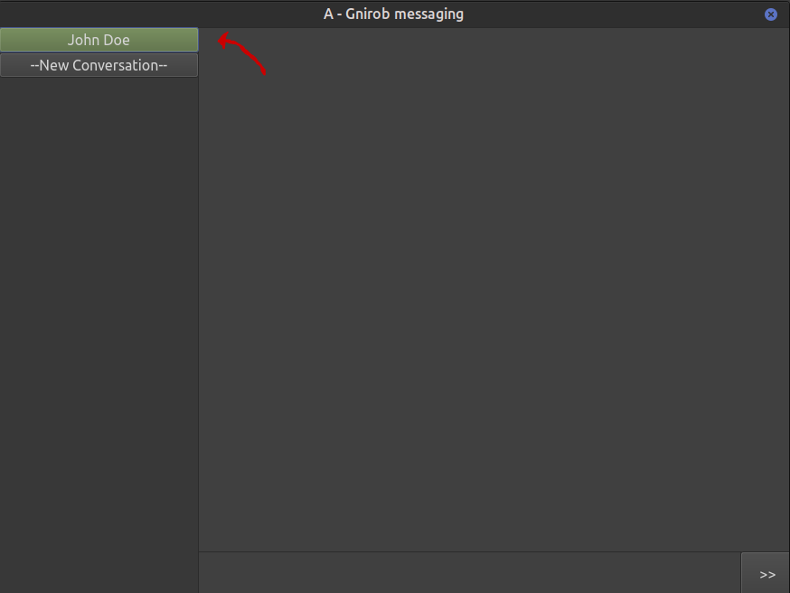

While a conversation is active, any messages send through the text box will be sent to that active conversation.

Now, let's send our a message to John Doe. The conversation with John Doe is already active, so all we need to do now is type something and send it to him.

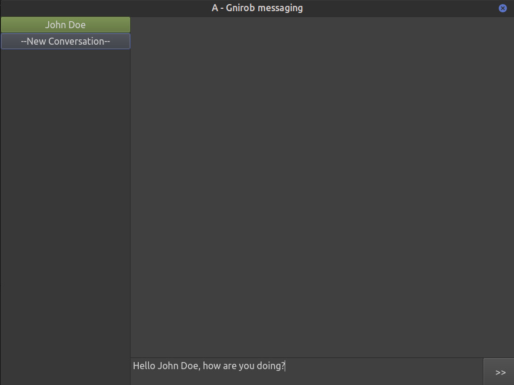

Here's what the message look like on our side:

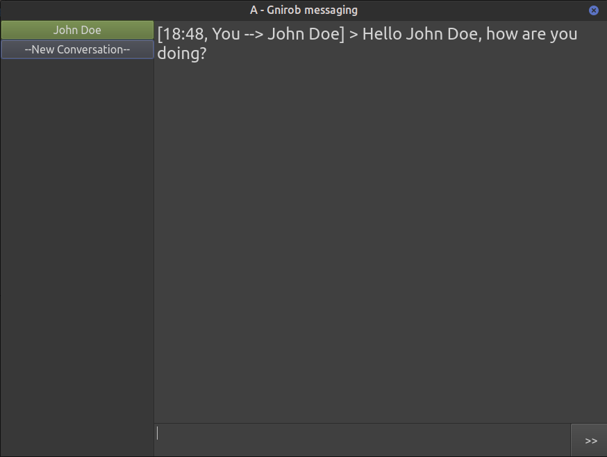

And here's the same message on John's side:

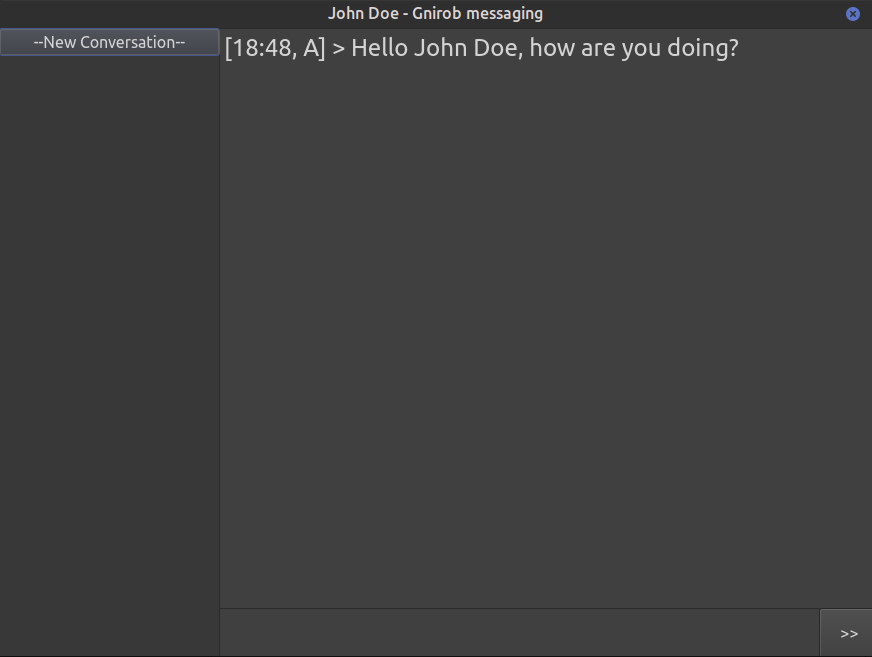

It's starting to get a bit boring with just two people, so let's add some more people to the party. We can create a new group by clicking on the "New Conversation" button and select "Group messaging". We will then get prompted with the following box.

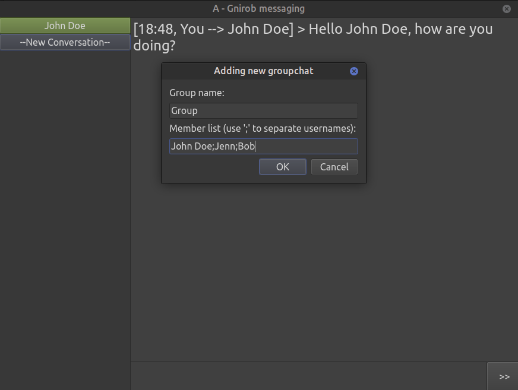

We just need to enter in the group name and its member. Notice that a ";" sign is used to separate member usernames. Once created, we can send messages to everyone in the group, which will be displayed on the receiver's side as "\<Group name\>/\<Sender's name\>".

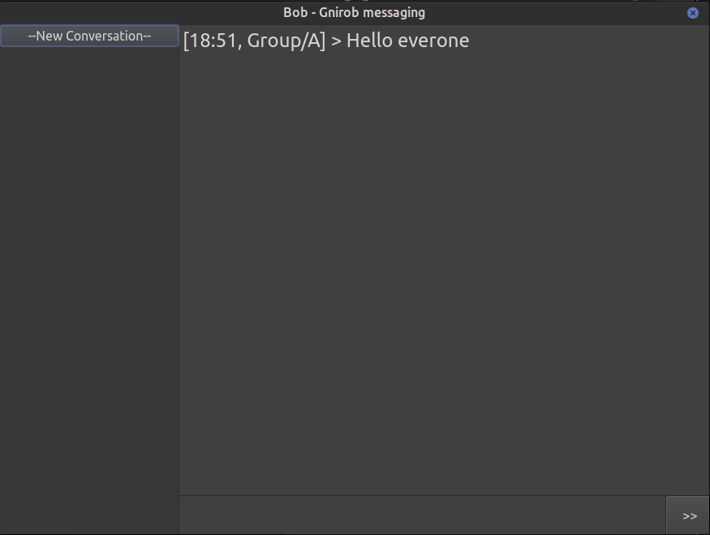
  
The app also allow group management features which are available to the owner. If a member other than the owner try to access the group management, they will be informed that they don't have the required permission to do so. To access the menu, right-click on the group in the conversation list.
  
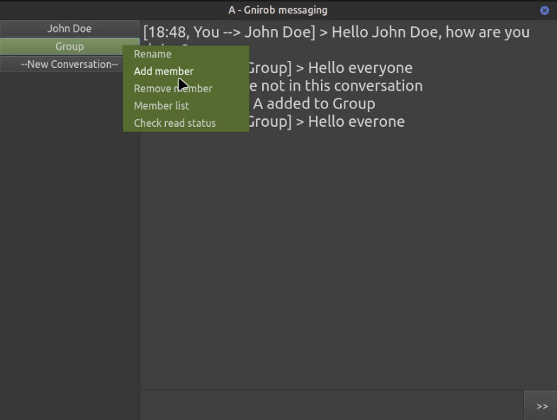

As an example, let's try renaming the group to a new name. A box is displayed for entering in the name, let's just call the group "New Name" for now.

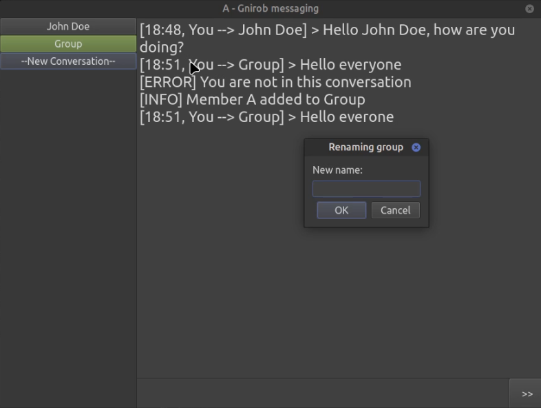

After renaming, the group will be displayed on the UI with its new name, and the messages sent to the group will also show the updated name. Let's send another message to the group to see the change.

Right-clicking on a direct message conversation will show a similar menu to the group management but with only two options: "send file" and "check read status". Let's try sending a file to our friend John Doe.

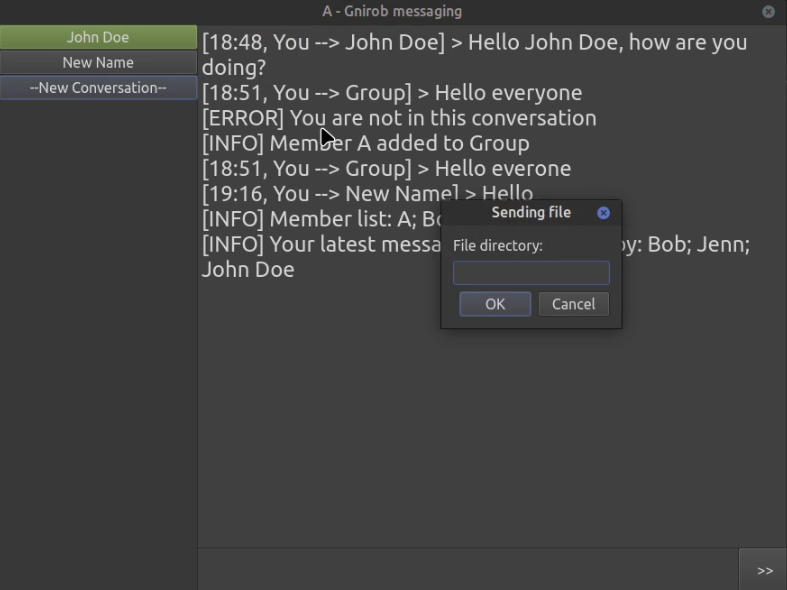

After entering in a file directory, the file will be sent to the target user. John will see the following pop-up notification about the file. He can then decide to either receive the file or discard it.

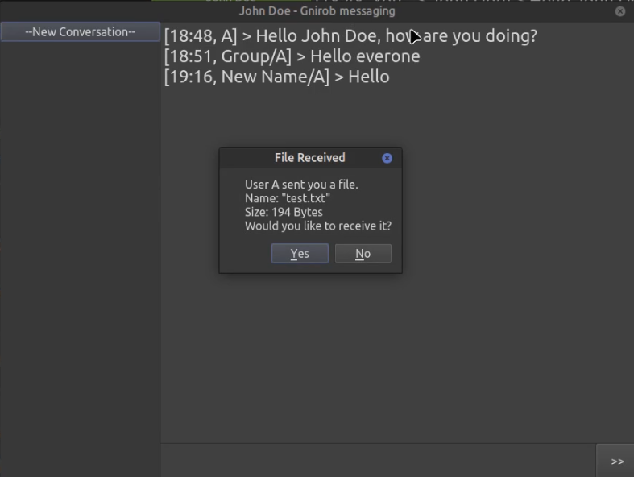

If he chooses to receive the file, it will be saved in the default directory "./received", relative to where the application file is stored.

Lastly, it is possible to check the server logs as the admin, which contains the history of all messages and actions performed by the clients.

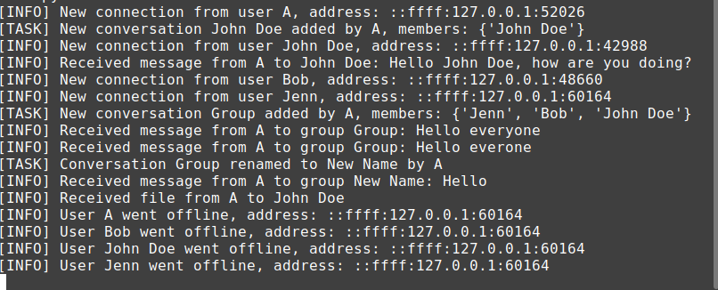

## Limitations and Possible Improvements
Although the application fullfils all the needed requirements from the assignment, there are still a few possible improvements to be made. Due to the tight time constraint, I had to prioritize certain things that are more important from the assignment point of view and glance over some other aspects. This section will into further details about what discuss in details the known limitations and possible improvements for the future.

Firstly, since this is an assignment for a course on Computer Networking, it focuses quite heavily on how socket programming works and the dynamic between server and clients. Because of that, the assignment focuses much more on supporting the required features rather than actual usability of the application. Therefore, I decided to skip the error handling part for this assignment. Namely, if the user do something unexpected, the application will stop working. One example of this is when a user create a group with only themselves, the application will crash when they send a message to that group. Handling interactions like these is not difficult. However, it will take up a lot of time to test and foolproof the entire application. Thus, I decided to skip it for now for the purpose of this assignment.

The application is also not secure. The first security flaw is the fact that the application have no password system. Because of this, users can just log in by typing in a username and become anyone. This obviously make the application unuseable in the real world. A second flaw is that messages are transfered un-encrypted. This means that theoretically anyone can intercept and read all the messages sent through the app. Furthermore, the user's messages are also stored in plain text on the server, which is a big compromise of user privacy.

Another flaw is that the application is memory-less. Past conversations will not be stored on the server and whenever the user exit and re-enter the app, they will lose track of the past conversations they had with others. Being memory-less also means that the application is not fault-tolerance, as all data will be lost if something happens to the server.

One minor thing that would worsen the user experience is the fact that all conversations are shown in the same text box. The user cannot simply switch between conversations and follow what is in that conversation alone. This implementation will quickly becomes unuseable if there are a lot of on-going messages. With a large number of messages and notifications being displayed in one place, it will become extremely hard to follow what is going on.

One last thing that I noticed about the way server and client communicate is that the current implementation of 'header' and 'data' is a little bit messy. The current system is based on the early stage of experimentation I had. Back then, I only need to send the length of the message in the header, followed by the data. I then built on top of that implementation and append MsgType and other information before each message. This implementation works relatively well, however, I find it quite troublesome to remember the order of the fields and send/receive them accordingly. One alternative implementation (inspired by a friend of mine) to solve this problem is to use dictionaries with keys such as {'message type','header','data'}, and just send a dictionary (along with its length header) whenever we need to send something. Then, on the receiver end, we just need to decode that dictionary and read the fields we need. This will make it much easier to follow the code, as well as making the sending/receiving process more concise. Interestingly, this implementation is quite similar to how JSON file works, and if I do a bit more research in the planning stage I might have used this implementation for my app. I will take this as a lesson to do more comprehensive research for my next projects. While itterative implementation is good to start moving as quickly as possible, I should  balance that with decent research. That way, I will ensure that the implementation process will become much smoother and leave less flaws that need to be fixed later on.
