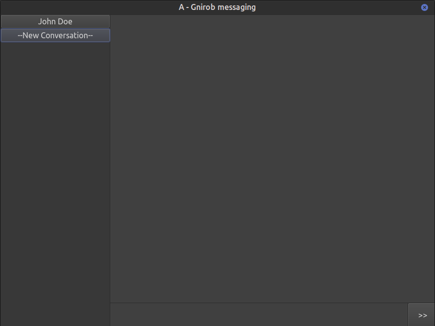

# A-simple-messaging-app-in-Python

## Introduction
This project is an assignment for the ELEC-C7420, Principles of Networking course at Aalto University. The main goal is to make a simple messaging app to practice socket programming. The project was implemented using Python and PyQt was used for the GUI.

**The core features of the app:**
- Direct messaging between clients
  - Client can add other users to their conversation list.
  - Client can select what user he/she wants to send the message to.
  - The server delivers messages to the specified user as requested by the client.
- Group messaging
  - Client can create a group.
  - The owner of the group can add/remove members from the group.
  - The owner can rename the group.
  - The server will forward the messages sent to the group to every member of said group.
- Offline messaging
  - Sender is informed if the receiver is offline and when the receiver was online last time.
  - Messages sent to an offline client will be buffered on the server and forwarded to the client once he/she go online again.
- Other features
  - Message display timestamp, sender, and the group (if it is a group message).
  - Check if the receiver has read your message or not.
  - Simutaneous connection of multiple clients.
  - Support both IPv4 and IPv6
- (Bonus feature) File transfer
  - Files of any format can be sent through the app.
  - The receiver is notified whenever someone sent them a file. They can view the information (name and size) of the file.
  - The receiver can decide if he/she wants to receive or discard the file.
- Voluntary extra features 
  - (somewhat) User-friendly and intuitive UI.
  - Server logs that show all messages and tasks carried out.
  - Send message by clicking Enter after the user finished typing.
  - Dedicated message box and conversation view.
  - Selecting active conversation with the mouse.

**Assignment Outcome:** 20/20 points + 2 Bonus points. Overall, I am quite happy with how the project turned out. I was able to learn a lot from this project and build something fun.
  
## Brief Application Walk-through
When you first open the application you will see the following interface. The app has three main elements: a conversation list, a message viewer, and a text box for entering messages. 

The user can select a conversation from the list by clicking on it, which will turn that conversation green and indicate that it is active.

While a conversation is active, any messages send through the text box will be sent to that active conversation.

Now, let's send our a message to John Doe. The conversation with John Doe is already active, so all we need to do now is type something and send it to him.

Here's what the message look like on our side:

And here's the same message on John's side:

It's starting to get a bit boring with just two people, so let's add some more people to the party. We can create a new group by clicking on the "New Conversation" button and select "Group messaging". We will then get prompted with the following box.

We just need to enter in the group name and its member. Notice that a ";" sign is used to separate member usernames. Once created, we can send messages to everyone in the group, which will be displayed on the receiver's side as "\<Group name\>/\<Sender's name\>".

  
The app also allow group management features which are available to the owner. If a member other than the owner try to access the group management, they will be informed that they don't have the required permission to do so. To access the menu, right-click on the group in the conversation list.
  

As an example, let's try renaming the group to a new name. A box is displayed for entering in the name, let's just call the group "New Name" for now.

After renaming, the group will be displayed on the UI with its new name, and the messages sent to the group will also show the updated name. Let's send another message to the group to see the change.

Right-clicking on a direct message conversation will show a similar menu to the group management but with only two options: "send file" and "check read status". Let's try sending a file to our friend John Doe.

After entering in a file directory, the file will be sent to the target user. John will see the following pop-up notification about the file. He can then decide to either receive the file or discard it.

If he chooses to receive the file, it will be saved in the default directory "./received", relative to where the application file is stored.

Lastly, it is possible to check the server logs as the admin, which contains the history of all messages and actions performed by the clients.

